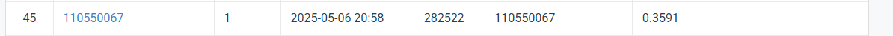

# Visual-Recognition-using-Deep-Learning-2025-Spring-HW3

| StudentID |   110550067 |
| --------- | :-----|
| **Name**  |    **簡秉霖** |


## Introduction

In this assignment, we tackle instance segmentation with 209 training images and 101 testing images. One of the main challenges is the small dataset size, which is due to the difficulty of annotating medical images. Additionally, most available pretrained models are trained on datasets like COCO or ImageNet, whose distributions differ significantly from medical imaging data.
To deal with this problem, I use the MaskRCNN class from pytorch and replace its backbone with a Swin Transformer (Small). By carefully fine-tuning the hyperparameters, I achieve 0.36 mAP on the public dataset, demonstrating the strength of the Mask R-CNN model.


## How to install
- Python version: 3.9

- Download required packages.<br>
  `pip install -r requirements.txt`
- Check the official Pytorch website to download torch-related packages, ensuring you select the correct CUDA version (11.8 in my case). <br>
`
pip install torch==2.1.2 torchvision==0.16.2 torchaudio==2.1.2 --index-url https://download.pytorch.org/whl/cu118
`

## Dataset structure
```
dataset/
├── train/
│   ├── image_001/
│   │   ├── image.tif
│   │   ├── class1.tif
│   │   ├── class2.tif
│   │   ├── class3.tif
│   │   └── class4.tif
│   ├── image_002/
│   │   ├── image.tif
│   │   ├── class1.tif
│   │   └── class3.tif
│   └── ... (more image folders)
│   
├── test_release/
│   ├── img_001.tif
│   ├── img_002.tif
│   └── ... (more .tif test images)
│
└── test_image_name_to_ids.json

```

## How to run
- Training 
  - ResNet-50 backbone  
    `python train_res.py --image-dir /path/to/your/dataset` 

  - Swin transformer(small) backbone  
    `python train_swin.py --image-dir /path/to/your/dataset`

- Testing
```sh
		python test.py --model-type res \
	  --weights best_model.pth \
	  --image-dir /path/to/your/dataset
```
 

## Performance snapshot



